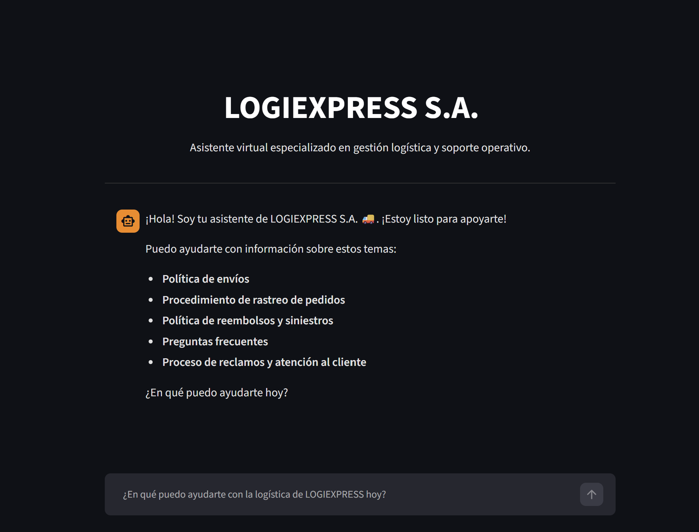

🚀 Agente Inteligente de Logística: LogiExpress S.A.
Transformando la atención al cliente mediante Inteligencia Artificial y datos estructurados.

📝 Descripción del Proyecto
Este agente inteligente fue desarrollado en el marco del programa Oracle Next Education. Su propósito es automatizar la atención al cliente para LogiExpress S.A., proporcionando respuestas precisas, rápidas y contextualizadas sobre procesos logísticos y políticas de la empresa, reduciendo la carga operativa humana.

🏗️ Arquitectura de la Solución
La solución sigue un enfoque modular basado en RAG (Retrieval-Augmented Generation):

Ingesta: Procesamiento y segmentación de documentos PDF de logística.

Embeddings: Conversión de texto a vectores mediante modelos multilingües.

Base de Datos: Almacenamiento eficiente con FAISS.

Consulta: Interfaz inteligente con LangChain que recupera el contexto relevante antes de generar la respuesta final.

🛠️ Tecnologías y Herramientas
Lenguaje: Python 3.14

Orquestación: LangChain

IA/Embeddings: Cohere (embed-multilingual-v3.0)

Vector Store: FAISS

Frontend: Streamlit

Despliegue: Streamlit Cloud

🚀 Instrucciones para Ejecutar
Clonar: `git clone https://github.com/pedroruizguerrero240-lab/agente-inteligente-alura.git`

Dependencias: pip install -r requirements.txt

Secrets: Configure su COHERE_API_KEY en su entorno local (archivo .env) o en los Secrets de su plataforma de despliegue.

Ejecutar: streamlit run app.py

💡 Ejemplos de Interacción
Preguntas frecuentes del usuario:
"¿Cuáles son los tiempos de entrega para envíos internacionales?"

"¿Cómo puedo solicitar un reembolso por un paquete dañado?"

"¿Qué documentos necesito para gestionar una exportación?"

Respuestas del Agente:
Usuario: ¿Cómo puedo rastrear mi pedido?
Agente: Para rastrear su pedido, ingrese al portal de LogiExpress S.A. con su número de guía. Si tiene problemas, proporcione su número aquí y con gusto verificaré el estado en nuestra base de datos.

## 👤 Autor
**Pedro Ruiz**  
Estudiante de Ingeniería en Ciencias de la Computación | ESPOL  
[Enlace a mi GitHub](https://github.com/pedroruizguerrero240-lab)
